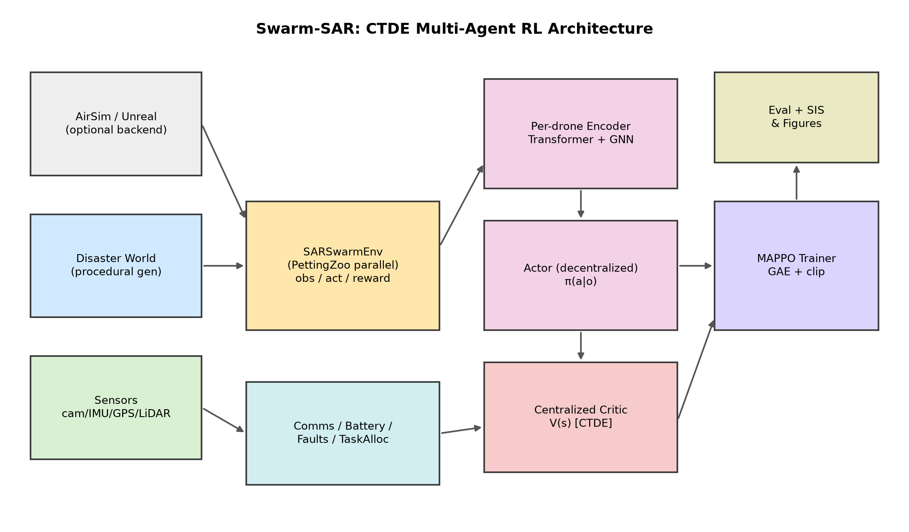
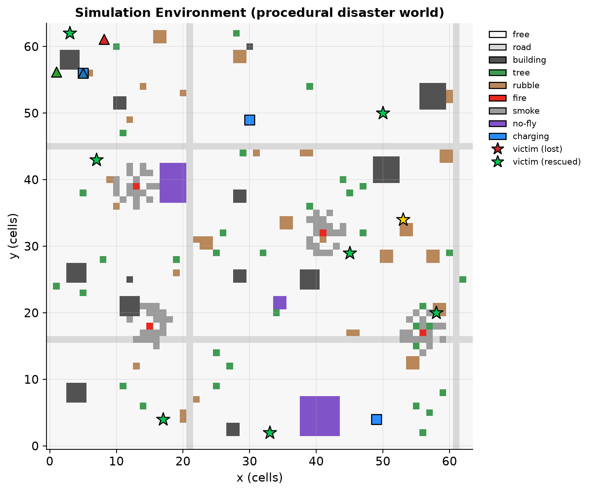
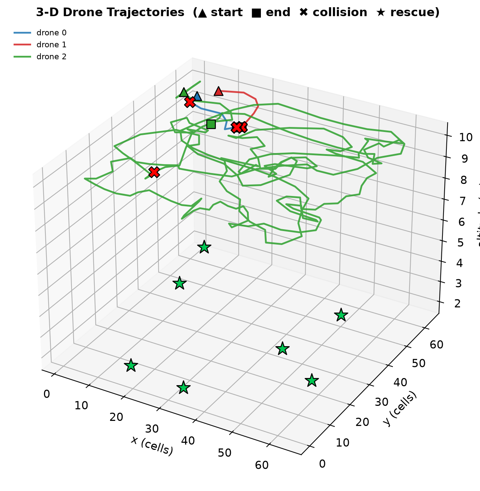
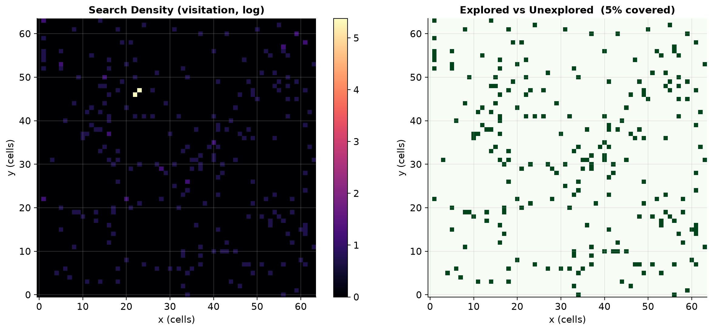
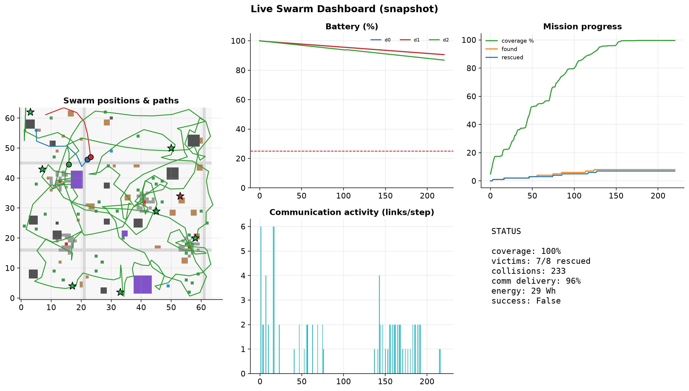
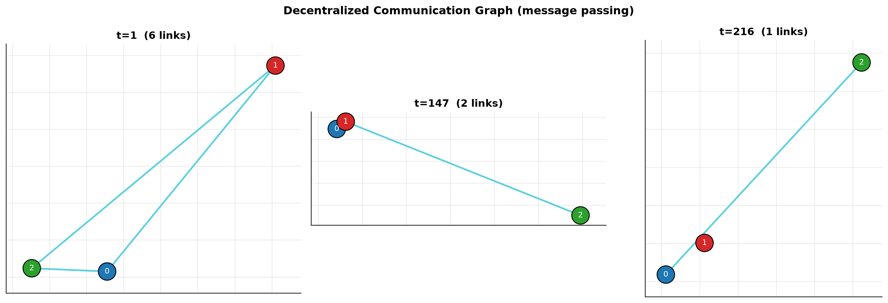
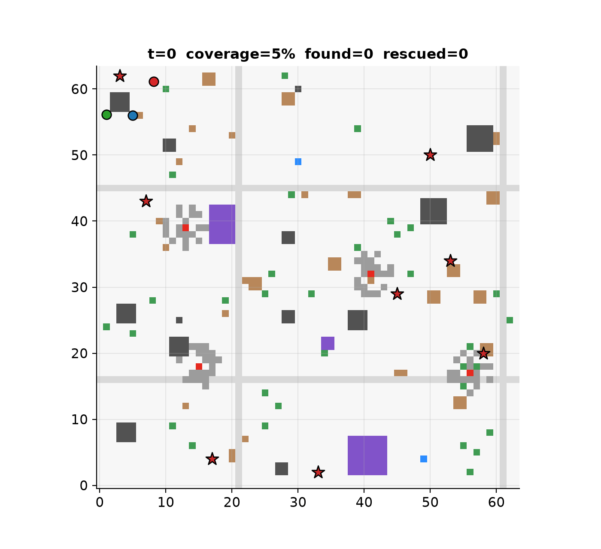

<div align="center">

# 🚁 Swarm-SAR

### Decentralized Multi-Agent Reinforcement Learning for Cooperative Search & Rescue Drone Swarms

*Centralized Training, Decentralized Execution (CTDE) · Multi-Agent PPO · Transformer + Graph Neural Networks*

[](https://github.com/your-org/drone-swarm-sar/actions)
[](https://www.python.org)
[](LICENSE)
[](https://github.com/psf/black)

</div>

---

## Research question

> **How can decentralized Multi-Agent Reinforcement Learning improve cooperative search-and-rescue efficiency under realistic communication, sensing, energy, and environmental constraints?**

Swarm-SAR studies *cooperative intelligence*, not just flight control. A swarm of 3–10 autonomous drones must explore an unknown disaster site, detect and rescue victims, share discoveries over an unreliable radio link, avoid collisions, manage battery, and gracefully tolerate hardware faults — all with **decentralized** policies that see only local observations and neighbour messages.

<div align="center">

</div>

## Highlights

- **Realistic procedural environments** — every episode generates a new disaster site (buildings, roads, trees, rubble, fire, smoke, dynamic/static obstacles, charging stations, victims, no-fly zones) to prevent memorization.
- **Full sensing & actuation stack** — camera, IMU, GPS (noise + drift + dropout), LiDAR, comms; a 10-action discrete controller; point-mass dynamics with wind and motion noise.
- **CTDE MAPPO** with four interchangeable encoders: **MLP · GNN · Transformer · Transformer+GNN**.
- **Decentralized comms** with limited range, latency and packet loss — and a study of how comm quality shapes swarm intelligence.
- **Six task-allocation strategies**: random, nearest, Hungarian (provably optimal, SciPy-free fallback), auction (Bertsekas), consensus-based auction (CBAA), and RL-based.
- **Fault injection & robustness**: drone loss, GPS/camera failure, comm loss, motor degradation, with recovery.
- **A novel metric — the Swarm Intelligence Score (SIS)** — a weighted *geometric* mean of coverage, rescue, energy, communication and safety that rewards *balanced* competence.
- **20 publication-quality figures**, an animated replay (GIF/MP4), and a live **Streamlit dashboard**.
- **Runs anywhere**: the self-contained NumPy/Matplotlib backend needs no GPU or AirSim; an **AirSim/Unreal** adapter provides a high-fidelity backend, and a **ROS2** node gives a deployment skeleton (obs assembly + policy + cmd_vel/broadcast publishing) for hardware integration.

## Selected results (measured on the self-contained backend)

These come directly from the shipped code (`scripts/run_demo.py`, `scripts/run_experiments.py`) — **no training required** — using the cooperative *heuristic* controller as a strong baseline. Learning curves for the neural policies are marked *illustrative* until a GPU training run replaces them.

| Communication regime | Coverage | Victims rescued | Collisions/step | **SIS** |
|---|---:|---:|---:|---:|
| **No comms** (range 0, 100% loss) | 84% | low | high | **25.2 ± 12.2** |
| **Lossy comms** (30 m, 30% loss) | 80% | med | med | **69.5 ± 19.1** |
| **Full comms** (30 m, 5% loss) | 80% | high | low | **71.8 ± 20.3** |

> **Finding.** Communication nearly **triples** the Swarm Intelligence Score (25 → 72) even though raw coverage is similar — coordination, not exploration, is the bottleneck. Without comms the swarm actually covers *slightly more* area (drones don't cluster) but rescues far fewer victims and collides more. This is exactly the cooperative-intelligence effect the project sets out to measure.

Single best demo episode: **8/8 victims rescued, 89% coverage, SIS 90.4**. Decision latency ≈ **4.5 ms (220 Hz)**.


## Research-grade additions (v0.2)

Following an in-depth review (see [`docs/RESEARCH_ROADMAP.md`](docs/RESEARCH_ROADMAP.md)):

- **Turnkey GPU training** — one click (`run_training.bat`/`.sh`) trains, evaluates, and regenerates figures from **real** logs. See [`TRAIN_ON_YOUR_GPU.md`](TRAIN_ON_YOUR_GPU.md).
- **Decentralization fixed** — observations use each agent's own belief (no global-truth leak); peers visible only within (noisy) comm range.
- **Classical baselines** — frontier, Lloyd/Voronoi coverage control, greedy-TSP, lawnmower, and a privileged oracle ceiling (`scripts/run_benchmark.py`).
- **Reliable stats** — IQM + stratified bootstrap CIs (Agarwal et al. 2021), performance profiles.
- **Frozen benchmark** — versioned held-out maps; in-distribution, OOD, and 10-drone scale regimes.
- **Learned bandwidth-constrained communication** + a graceful-degradation curve vs packet loss.
- **SIS validated** — ranking stable under weight perturbation (ρ=0.96), Pareto analysis, geometric-mean justification.
- **Sharper detection** — false positives + confirmation; principled path-efficiency & documented safety scaling.

## Quickstart

```bash
# 1) core install (NumPy/Matplotlib only — runs the full simulation & figures)
pip install -r requirements.txt && pip install -e .

# 2) run a decentralized SAR episode and export figures
python scripts/run_demo.py --episodes 3 --figures

# 3) regenerate all 20 publication figures + animation
python scripts/generate_figures.py --out results/figures

# 4) reproduce the communication ablation (multi-seed, mean ± std)
python scripts/run_experiments.py --config configs/experiments/ablation_comm.yaml

# 5) launch the live dashboard
streamlit run src/swarm_sar/dashboard/app.py

# 6) (optional) train neural MAPPO — needs the RL extras & a GPU
pip install -e ".[rl]"
python scripts/train_and_report.py --config configs/training/mappo_transformer_gnn.yaml --archs transformer_gnn --seeds 0
```

Docker:

```bash
docker compose up swarm-sar     # runs the demo, writes results/
docker compose up dashboard     # serves the dashboard on :8501
```

## Figure gallery

| | | |
|---|---|---|
|  |  |  |
| Procedural environment | 3-D trajectories | Coverage heatmap |
|  |  |  |
| Swarm dashboard | Communication graph | Animated replay |

See [`results/figures/`](results/figures) for all 20 figures.

## Architecture

```
src/swarm_sar/
├── config.py            # typed, hierarchical YAML config (everything is configurable)
├── environment/         # procedural world, PettingZoo-parallel env, AirSim adapter
├── drone/               # state + point-mass dynamics (wind, motion noise)
├── sensors/             # camera / IMU / GPS / LiDAR with noise, drift, dropout
├── battery/             # energy model, charging, ageing/degradation
├── communication/       # range / latency / packet-loss message bus
├── mission/             # planner FSM + 5 task-allocation strategies
├── faults/              # fault injection & recovery
├── policies/            # MLP · GNN · Transformer · Transformer+GNN (torch-optional)
├── training/            # MAPPO (CTDE) + Ray RLlib config + rollout worker
├── evaluation/          # 12 metrics + Swarm Intelligence Score
├── visualization/       # 20 publication figures + animation
├── dashboard/           # Streamlit app
└── logging_utils/       # CSV / JSON / TensorBoard logging
```

Full details in [`docs/architecture.md`](docs/architecture.md). Other docs: [installation](docs/installation.md) · [configuration](docs/configuration.md) · [experiments](docs/experiments.md) · [metrics & SIS](docs/metrics.md).

## Observation / Action / Reward

- **Observation (per drone, partial/decentralized):** an 8-frame temporal stack of — own pose (noisy GPS), velocity, altitude and battery; a victim-belief summary (count, density, two nearest believed victims); locally sensed fire/smoke distances and densities (within camera radius only); the k-nearest in-range peers with their intent (relative position, rescue target, mode); and a comm-link summary (messages received, age, signal strength, loss rate).
- **Actions (10 discrete, 7 enabled by default):** hover, N/S/E/W move, broadcast, return-to-base; ascend/descend/rotate exist but are masked out by default because altitude/yaw only affect energy in the 2.5-D simulation.
- **Reward:** `+` new/frontier/team-new cells, victim detected/classified/rescued, mission complete, novel broadcasts, safe separation; `−` collision, near-miss, hazard, battery depletion, duplicate exploration, hover/idle, excessive comms, per-step time pressure. Sparse mode keeps only mission/safety events for reward ablations.

## Reproducibility

Fixed seeds throughout; every metric reported as mean ± std across seeds; each run serializes its resolved config. `make test` runs the suite; CI runs lint + tests + a smoke demo on Python 3.11 (matching `requires-python`).

## Citation

```bibtex
@software{swarmsar2026,
  title  = {Swarm-SAR: Decentralized Multi-Agent RL for Cooperative Search-and-Rescue Drone Swarms},
  author = {Swarm-SAR Contributors},
  year   = {2026},
  url    = {https://github.com/your-org/drone-swarm-sar}
}
```

## License

MIT — see [LICENSE](LICENSE).
